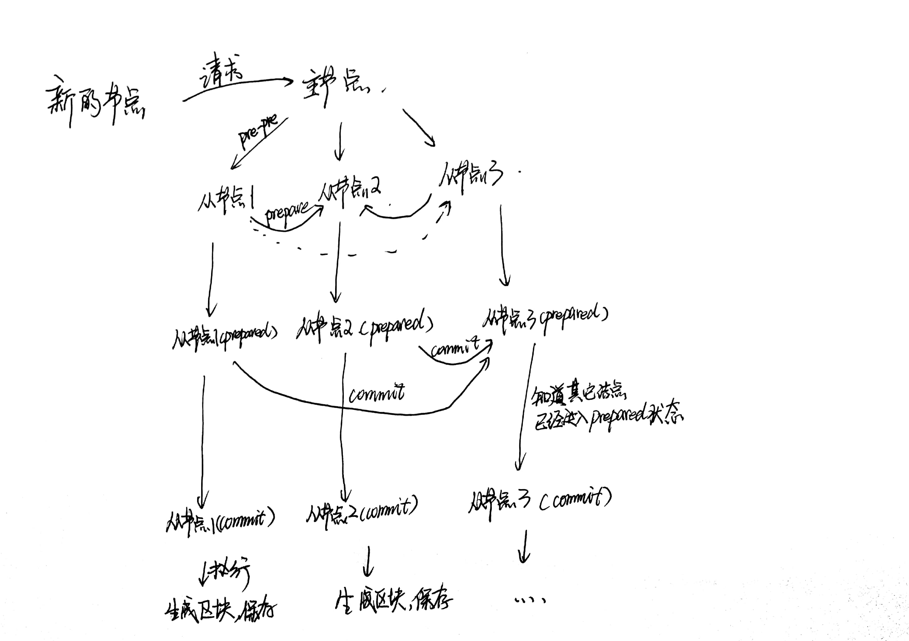

## Java 区块链实现方案
此项目不是一个完整的区块链的实现方案。该项目包括（目前的想法包括）：
- 数据储存
- 网络通信
- 共识算法

在这里并不会实现交易的功能，毕竟我又不发行币。

## 使用的开发工具包
- hutool：提供工具类
在hutool中，提供了很多工具类，这样节省了自己去写一些算法的时间，使更聚焦于逻辑
- fastjson：提供json解析
fastjson的性能杠杠的
- t-io：构建p2p网络，节点既是客户端又是服务端
在netty和t-io中间，选择了t-io，是因为t-io的使用上面还是比较简单的，更容易上手，并且其性能也不错。不过真的是服了文档收费。
使用t-io构建PBFT算法。
- leveldb：负责区块链的数据存储

## 思路图（目前2019.12.14）
目前也是正在学习区块链，有些不对的地方，望指正。

CA中心与节点的关系：

可以这样解释：
A->B
1. A将自己的msg中间的摘要（也就是经过hash计算）使用自己的私钥进行签名。然后使用CA中心的私钥对A的公钥进行加密得到数字证书（里面还包括A的其他信息）。
2. B接受到消息后，首先向CA中心拿到公钥，得到数字证书中间的内容（A的信息和A的公钥），然后使用A的公钥对msg的摘要进行签名操作
3. 判断签名与第二步的签名是否一致。
PBFT流程图

认证流程图

## 区块中保存的信息
首先每个节点区块中保存的信息（可能）不相同（这点可能跟其他的区块链有点不一样），在里面选择保存PDFT算法中参与认证的节点。如果网络通信出现问题，就会出现节点之间信息不同的问题（who care?I don't care）。

## 进行PBFT认证所需要的信息

